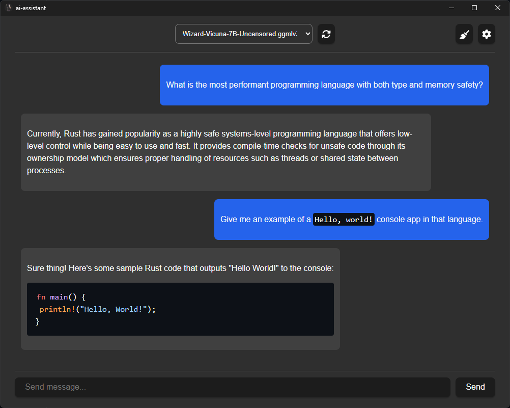

# AI Assistant

This is a simple AI chat assistant built using [Rust](https://www.rust-lang.org/) as the backend and [Tauri](https://tauri.app/) + [Vue 3](https://vuejs.org/) for the frontend. It supports all desktop platforms and can use your GPU to improve performance. The entire app compiles to just one executable and should be fairly small (~under 7MB). To get started you just need to add your models in the Model Folder found in Settings.




## Models

The LLaMA architecture is the most well-supported.

* https://huggingface.co/TheBloke/Wizard-Vicuna-7B-Uncensored-GGML
* https://huggingface.co/rustformers/open-llama-ggml
* https://huggingface.co/TheBloke/open-llama-13b-open-instruct-GGML
* https://huggingface.co/TheBloke/Flan-OpenLlama-7B-GGML


## Acceleration Support

| Platform/OS | `cublas`           | `clblast`          | `metal`            |
| ----------- | ------------------ | ------------------ | ------------------ |
| Windows     | :heavy_check_mark: | :heavy_check_mark: | :x:                |
| Linux       | :heavy_check_mark: | :heavy_check_mark: | :x:                |
| MacOS       | :x:                | :x:                | :heavy_check_mark: |

### Utilizing GPU Support

GPU support is determined by the `features` of the `llm` dependency.

```toml
[dependencies]
llm = { git = "https://github.com/rustformers/llm.git", branch = "main" }

[features]
cublas = ["llm/cublas"]
clblast = ["llm/clblast"]
metal = ["llm/metal"] 
```

Features can be turned on in the `tauri.<platform>.conf.json` file.

```json
{
    "build": {
      "features": [ "cublas" ]
    }
}
```

### Windows

#### CuBLAS

CUDA must be installed. You can download CUDA from the official [Nvidia site](https://developer.nvidia.com/cuda-downloads).

#### CLBlast

CLBlast can be installed via [vcpkg](https://vcpkg.io/en/getting-started.html) using the command `vcpkg install clblast`. After installation, the `OPENCL_PATH` and `CLBLAST_PATH` environment variables should be set to the `opencl_x64-windows` and `clblast_x64-windows` directories respectively.

### Linux

#### CuBLAS

You need to have CUDA installed on your system. CUDA can be downloaded and installed from the official [Nvidia site](https://developer.nvidia.com/cuda-downloads). On Linux distributions that do not have `CUDA_PATH` set, the environment variables `CUDA_INCLUDE_PATH` and `CUDA_LIB_PATH` can be set to their corresponding paths.

#### CLBlast

CLBlast can be installed on Linux through various package managers. For example, using `apt` you can install it via `sudo apt install clblast`. After installation, make sure that the `OPENCL_PATH` and `CLBLAST_PATH` environment variables are correctly set. Additionally the environment variables `OPENCL_INCLUDE_PATH`/`OPENCL_LIB_PATH` & `CBLAST_INCLUDE_PATH`/`CLBLAST_LIB_PATH` can be used to specify the location of the files. All environment variables are supported by all listed operating systems.

### MacOS

#### Metal

Xcode and the associated command-line tools should be installed on your system, and you should be running a version of MacOS that supports Metal. For more detailed information, please consult the [official Metal documentation](https://developer.apple.com/metal/).


## Building

### Recommended IDE Setup

- [VS Code](https://code.visualstudio.com/) + [Volar](https://marketplace.visualstudio.com/items?itemName=Vue.volar) + [Tauri](https://marketplace.visualstudio.com/items?itemName=tauri-apps.tauri-vscode) + [rust-analyzer](https://marketplace.visualstudio.com/items?itemName=rust-lang.rust-analyzer)

### Prerequisites

1. Install [Rust](https://www.rust-lang.org/)
2. Install C++ build tools. This can be added in Visual Studio by checking "Desktop development with C++".
3. Make sure your OS supports WebView2. Windows 10 and 11 should by default.
4. [Node.js](https://nodejs.org/en)
5. Install the tauri cli: `cargo install tauri-cli`

More detailed instructions can be found [here](https://tauri.app/v1/guides/getting-started/prerequisites).

### Getting Started

First install dependencies for the frontend:

```
npm install
```

To run the project you can then use the following command:

```
cargo tauri dev
```

And to build you can use:

```
cargo tauri build
```

After starting the program you'll need to add any models to your Model Folder directory (defaults to app data for the given platform). Then you can hit the refresh button next to the models list and select your model.
