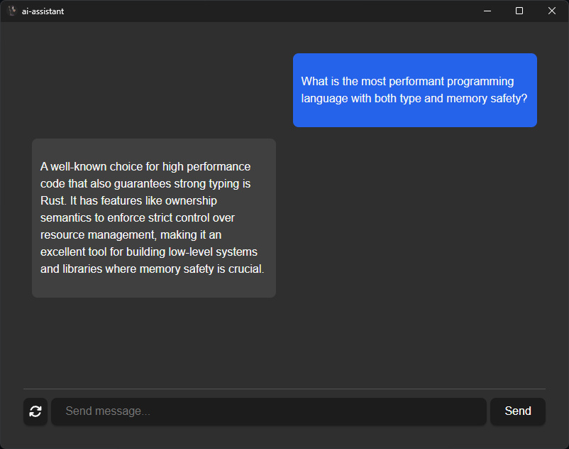

# AI Assistant

This is a simple AI chat assistant built using [Rust](https://www.rust-lang.org/) as the backend and [Tauri](https://tauri.app/) + [Vue 3](https://vuejs.org/) for the frontend.



## Models

The LLaMA architecture is the most well-supported.

* https://huggingface.co/TheBloke/Wizard-Vicuna-7B-Uncensored-GGML
* https://huggingface.co/rustformers/open-llama-ggml
* https://huggingface.co/TheBloke/open-llama-13b-open-instruct-GGML
* https://huggingface.co/TheBloke/Flan-OpenLlama-7B-GGML


## Acceleration Support

| Platform/OS | `cublas`           | `clblast`          | `metal`            |
| ----------- | ------------------ | ------------------ | ------------------ |
| Windows     | :heavy_check_mark: | :heavy_check_mark: | :x:                |
| Linux       | :heavy_check_mark: | :heavy_check_mark: | :x:                |
| MacOS       | :x:                | :x:                | :heavy_check_mark: |

### Utilizing GPU Support

GPU support is determined by the `features` of the `llm` dependency.

```toml
[dependencies]
llm = { git = "https://github.com/rustformers/llm.git", branch = "main", features = ["cublas"] } 
```

### Windows

#### CuBLAS

CUDA must be installed. You can download CUDA from the official [Nvidia site](https://developer.nvidia.com/cuda-downloads).

#### CLBlast

CLBlast can be installed via [vcpkg](https://vcpkg.io/en/getting-started.html) using the command `vcpkg install clblast`. After installation, the `OPENCL_PATH` and `CLBLAST_PATH` environment variables should be set to the `opencl_x64-windows` and `clblast_x64-windows` directories respectively.

### Linux

#### CuBLAS

You need to have CUDA installed on your system. CUDA can be downloaded and installed from the official [Nvidia site](https://developer.nvidia.com/cuda-downloads). On Linux distributions that do not have `CUDA_PATH` set, the environment variables `CUDA_INCLUDE_PATH` and `CUDA_LIB_PATH` can be set to their corresponding paths.

#### CLBlast

CLBlast can be installed on Linux through various package managers. For example, using `apt` you can install it via `sudo apt install clblast`. After installation, make sure that the `OPENCL_PATH` and `CLBLAST_PATH` environment variables are correctly set. Additionally the environment variables `OPENCL_INCLUDE_PATH`/`OPENCL_LIB_PATH` & `CBLAST_INCLUDE_PATH`/`CLBLAST_LIB_PATH` can be used to specify the location of the files. All environment variables are supported by all listed operating systems.

### MacOS

#### Metal

Xcode and the associated command-line tools should be installed on your system, and you should be running a version of MacOS that supports Metal. For more detailed information, please consult the [official Metal documentation](https://developer.apple.com/metal/).

To enable Metal using the CLI, ensure it was built successfully using `--features=metal` and then pass the `--use-gpu` flag.


## Building

### Recommended IDE Setup

- [VS Code](https://code.visualstudio.com/) + [Volar](https://marketplace.visualstudio.com/items?itemName=Vue.volar) + [Tauri](https://marketplace.visualstudio.com/items?itemName=tauri-apps.tauri-vscode) + [rust-analyzer](https://marketplace.visualstudio.com/items?itemName=rust-lang.rust-analyzer)

### Prerequisites

1. Install [Rust](https://www.rust-lang.org/)
2. Install C++ build tools. This can be added in Visual Studio by checking "Desktop development with C++".
3. Make sure your OS supports WebView2. Windows 10 and 11 should by default.
4. [Node.js](https://nodejs.org/en)
5. Install the tauri cli: `cargo install tauri-cli`

More detailed instructions can be found [here](https://tauri.app/v1/guides/getting-started/prerequisites).

### Getting Started

First you'll need to create a `.env` file and add your model path.

```
MODEL_PATH="C:\\Users\\You\\Downloads\\Wizard-Vicuna-7B-Uncensored.ggmlv3.q4_1.bin"
```

Then you need to make sure the front end is ready to go:

```
npm install
```

To run the project you can use the following command:

```
cargo tauri dev
```

And to build you can use:

```
cargo tauri build
```

A Github Action can also be used. Below is an example:

```yaml
name: Release
on:
  push:
    tags:
      - 'v*'
  workflow_dispatch:

jobs:
  release:
    permissions:
      contents: write
    strategy:
      fail-fast: false
      matrix:
        platform: [macos-latest, ubuntu-20.04, windows-latest]
    runs-on: ${{ matrix.platform }}

    steps:
      - name: Checkout repository
        uses: actions/checkout@v4

      - name: Install dependencies (ubuntu only)
        if: matrix.platform == 'ubuntu-20.04'
        # You can remove libayatana-appindicator3-dev if you don't use the system tray feature.
        run: |
          sudo apt-get update
          sudo apt-get install -y libgtk-3-dev libwebkit2gtk-4.0-dev libayatana-appindicator3-dev librsvg2-dev

      - name: Rust setup
        uses: dtolnay/rust-toolchain@stable

      - name: Rust cache
        uses: swatinem/rust-cache@v2
        with:
          workspaces: './src-tauri -> target'

      - name: Sync node version and setup cache
        uses: actions/setup-node@v4
        with:
          node-version: 'lts/*'
          cache: 'npm' # Set this to npm, yarn or pnpm.

      - name: Install frontend dependencies
        # If you don't have `beforeBuildCommand` configured you may want to build your frontend here too.
        run: npm install # Change this to npm, yarn or pnpm.

      - name: Build the app
        uses: tauri-apps/tauri-action@v0

        env:
          GITHUB_TOKEN: ${{ secrets.GITHUB_TOKEN }}
        with:
          tagName: ${{ github.ref_name }} # This only works if your workflow triggers on new tags.
          releaseName: 'App Name v__VERSION__' # tauri-action replaces \_\_VERSION\_\_ with the app version.
          releaseBody: 'See the assets to download and install this version.'
          releaseDraft: true
          prerelease: false
```
